# Liquid Stack

[简体中文](README.zh.md) · [Theme demo](https://liquid-stack.pages.dev/) · [Production site](https://jingyuan-zheng.github.io/) · [Use this template](https://github.com/new?template_name=Liquid-Stack&template_owner=Jingyuan-Zheng)

Liquid Stack v1.2.0 is a complete bilingual Hugo site starter built on the unmodified [Hugo Theme Stack](https://github.com/CaiJimmy/hugo-theme-stack) v4.0.3. It keeps Stack's blog foundation and adds a profile homepage, launchpad, interactive photo wall, content dashboard, Sveltia CMS, enhanced Waline integration, friend-link workflow, bilingual sitemaps, and ready-to-edit sample content.

## What's new in v1.2.0

- A mobile profile top bar that keeps theme, language, and menu controls available while scrolling
- Touch-friendly floating navigation for long About or résumé pages
- An optional fictional product-catalog demo with bilingual data, search, filtering, sorting, collapsible groups, and mobile cards
- Baseline Web App support with install icons, a manifest, standalone metadata, and light/dark browser theme colours
- Optional secure Waline upload and comment-verification hooks, disabled until a compatible backend is configured
- Optional human-written and AI-assisted article labels, including CMS controls and bilingual examples

Read the bilingual [Liquid Stack 1.2.0 release note](https://liquid-stack.pages.dev/p/liquid-stack-1-2-0/) for the user-facing update, or see [`docs/feature-port-checklist.md`](docs/feature-port-checklist.md) for the implementation and validation record.

## Screenshots

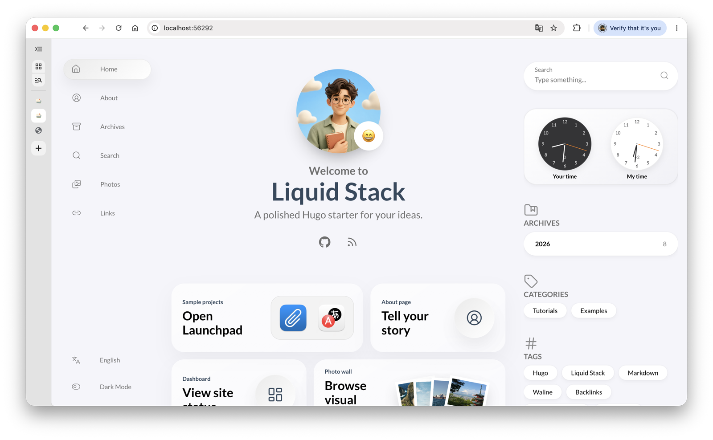

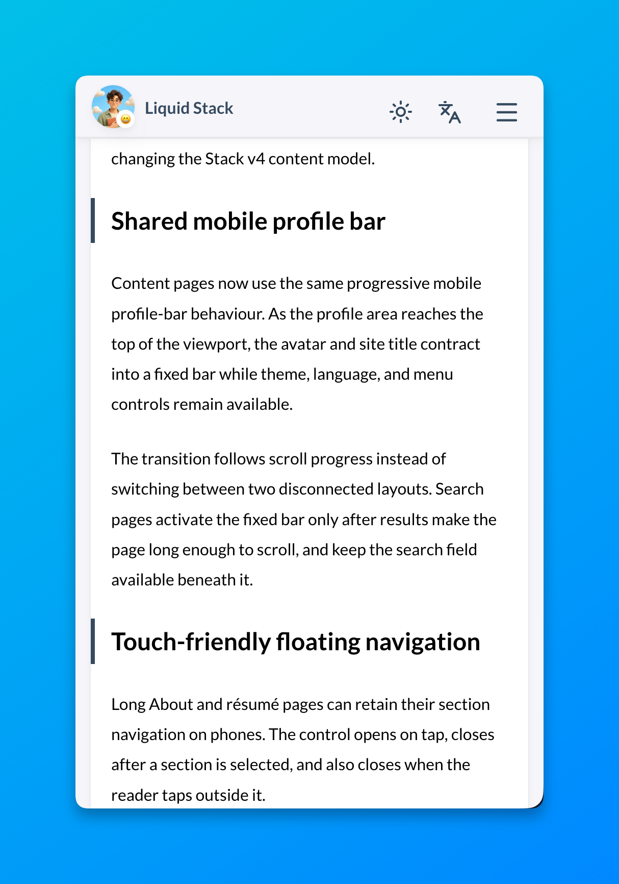

| Homepage announcement | Expanded announcement |
| --- | --- |
| 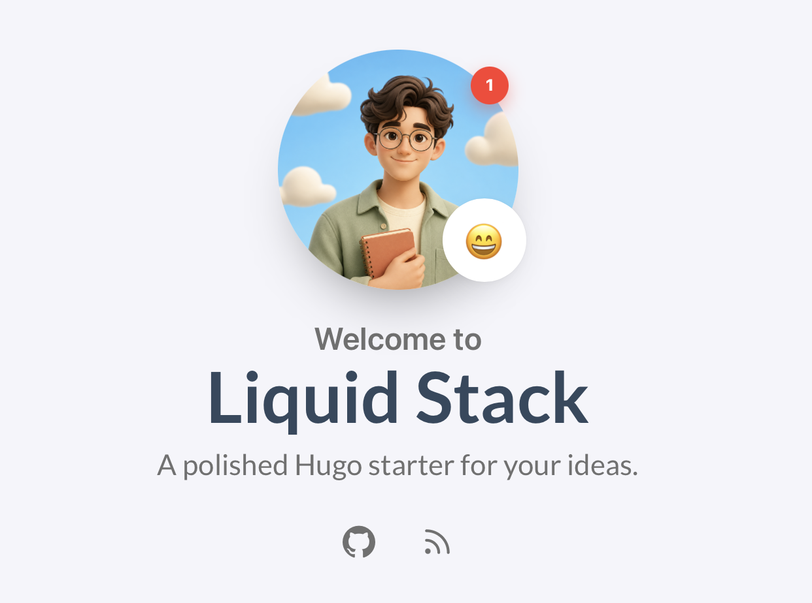 | 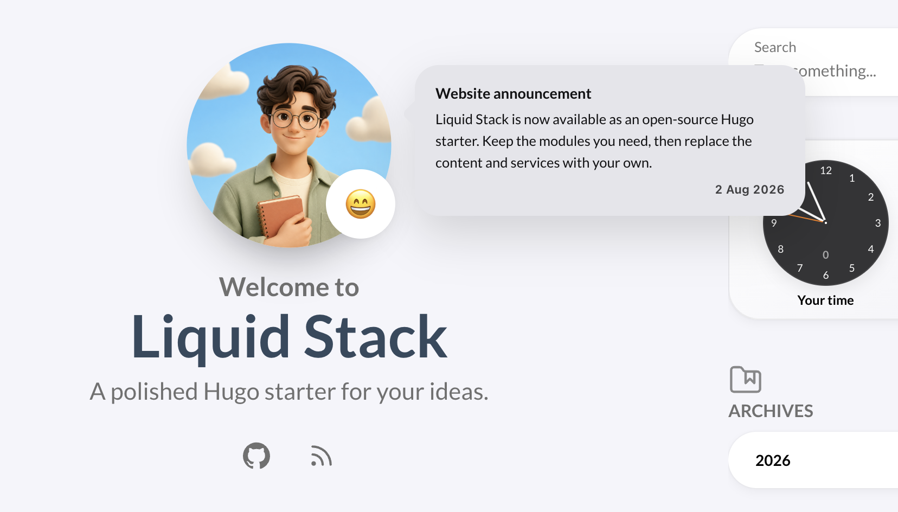 |

| Liquid Glass details | Launchpad and photo wall |
| --- | --- |
| 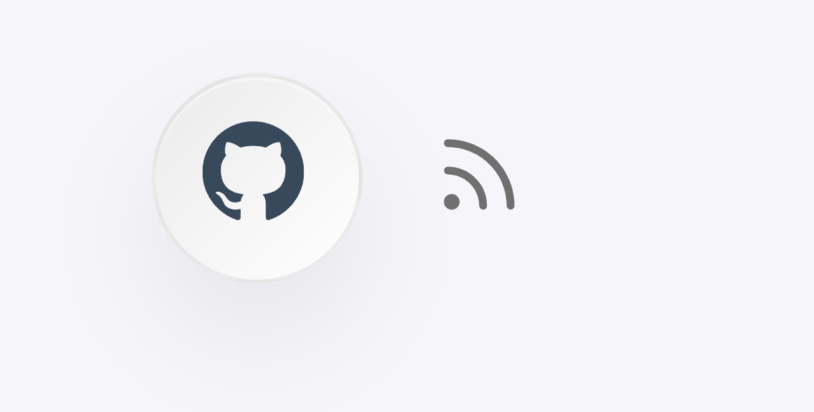 | 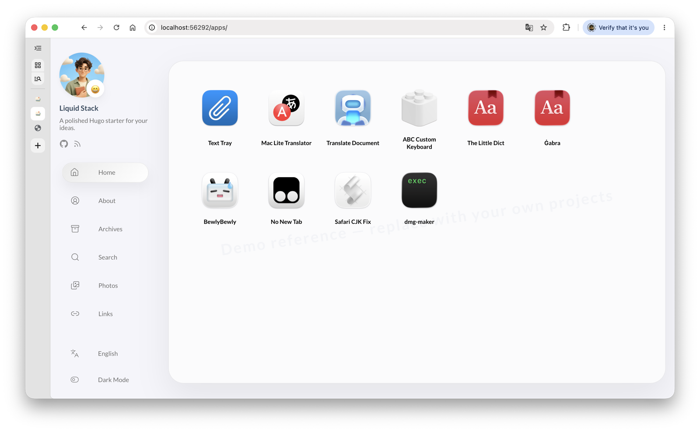 |
| 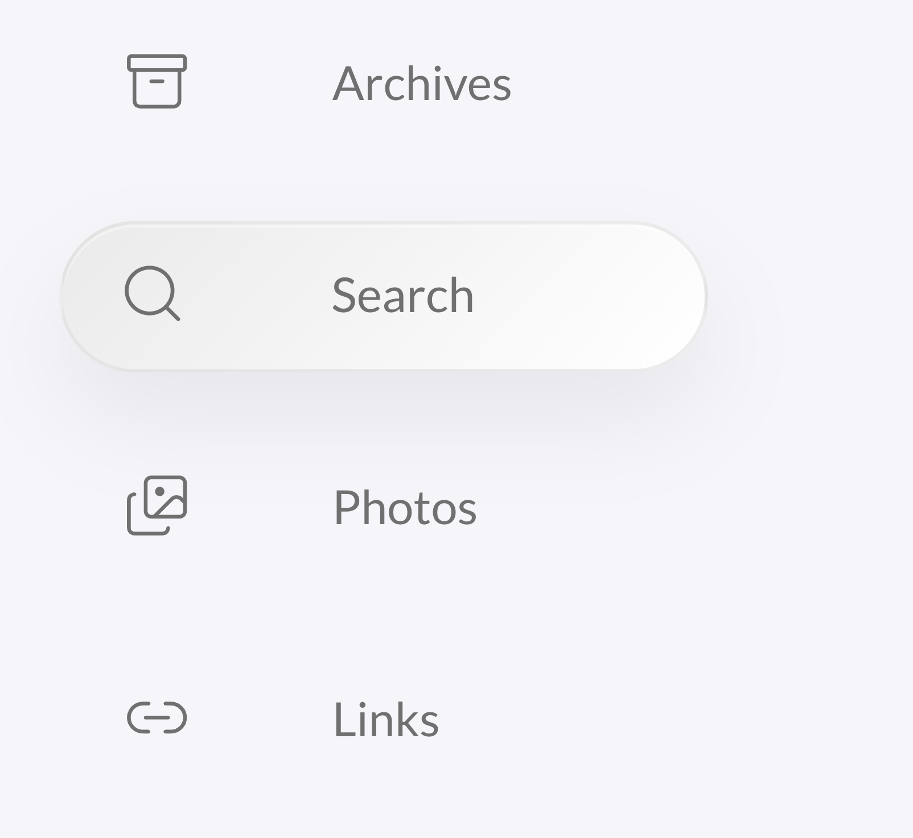 | 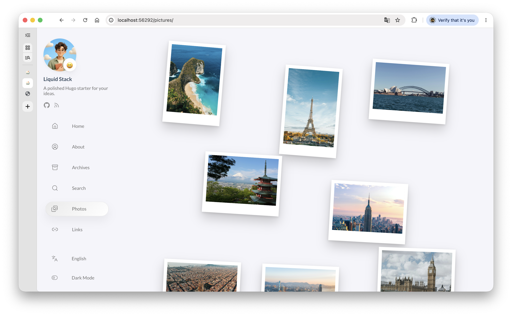 |

| Dashboard | Visual CMS | Comments |
| --- | --- | --- |
| 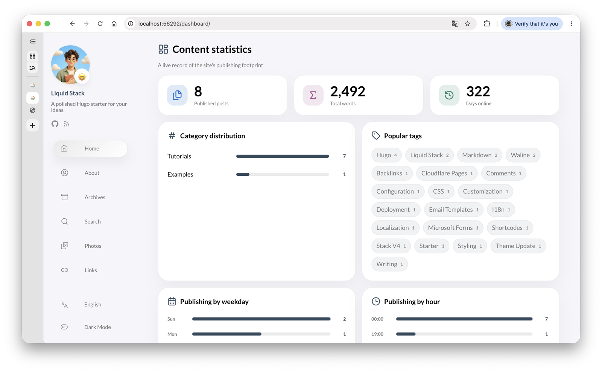 | 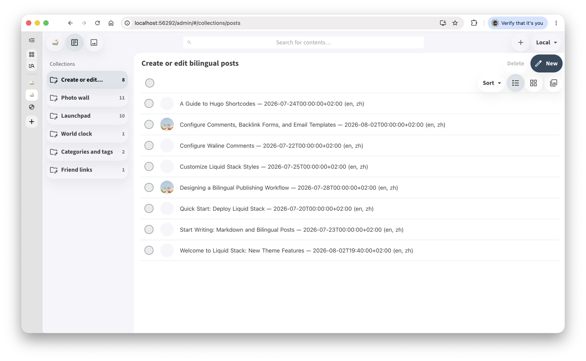 | 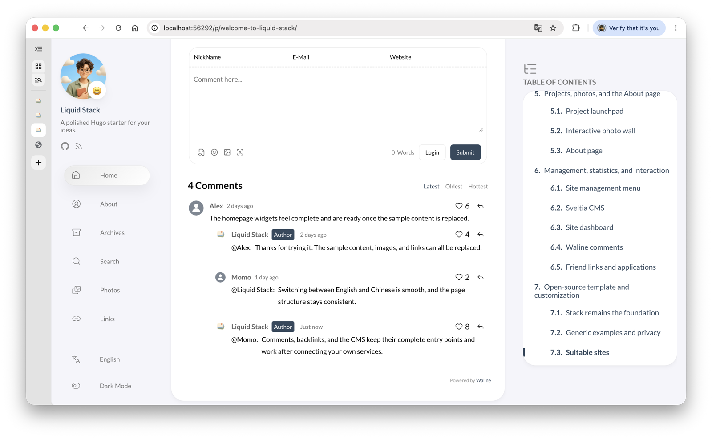 |

| Site management menu | Backlink application template |
| --- | --- |
| 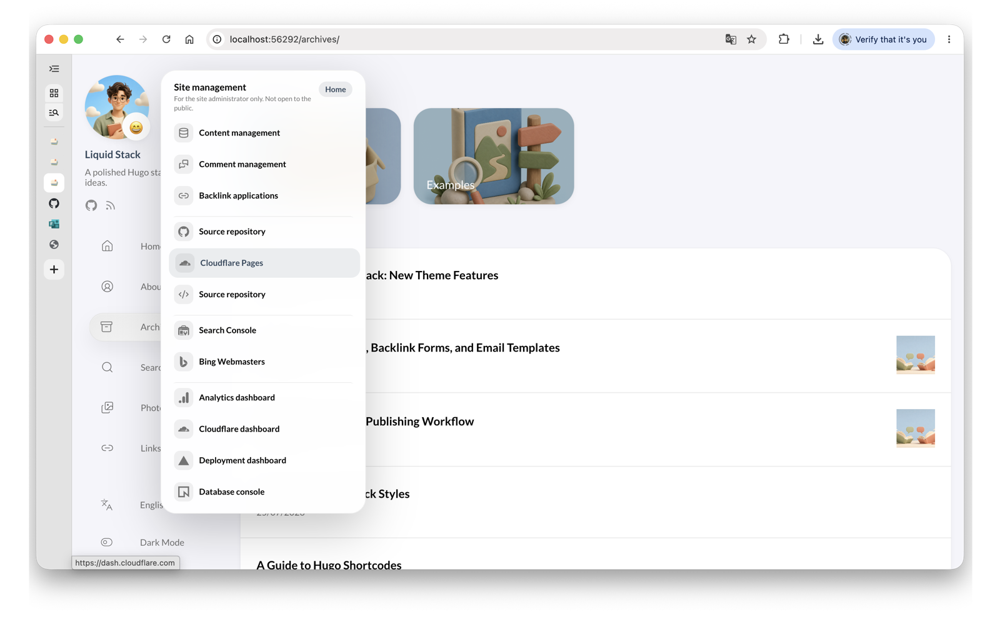 | 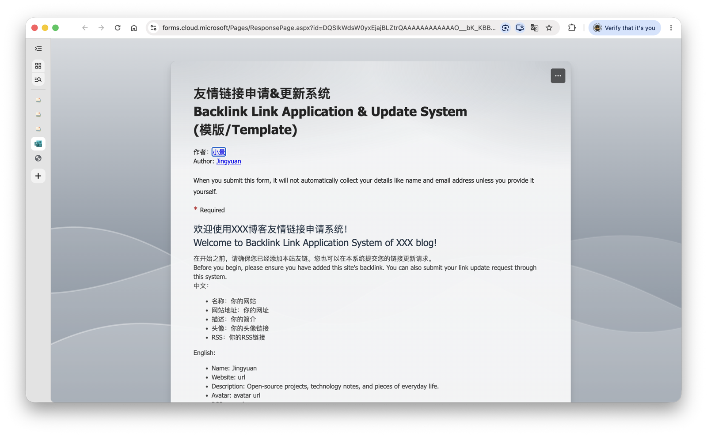 |

See the complete annotated gallery on the [project website](https://jingyuan-zheng.github.io/Liquid-Stack/).

## What Liquid Stack adds

### Visual system

- A web interpretation of Apple's Liquid Glass language with translucent overlays, background blur, soft surfaces, and light/dark adaptation
- A consistent rounded-corner hierarchy across article cards, homepage widgets, panels, controls, and badges
- Lucide line icons for interface actions and navigation
- A neutral grey-lavender palette with restrained functional accents
- Baseline Web App metadata for install icons, standalone display, and browser theme colors (without offline caching)

### Homepage widgets

- A profile hero with replaceable identity, introduction, and social links
- Shortcut cards for the launchpad, About page, dashboard, and photo wall
- Two analogue world clocks for the visitor's local time and the configured site time
- Stack's search, archives, categories, tags, and article feed in the same visual system

### Reading and bilingual publishing

- Browser-localized article dates, print and sharing actions, related posts, a table of contents, and full-text search
- Automatic English and Simplified Chinese selection with saved language preference and matching-translation navigation
- Reader-facing bilingual sitemaps, multilingual XML sitemaps, and a search-assisted 404 page

### Projects, photos, and About

- A data-driven project launchpad with icons, previews, article links, and repository links
- A draggable photo wall for portrait and landscape images with a focused viewer and browser-saved positions
- An animated About layout with timeline sections and a floating menu that can present a profile, site story, portfolio, or résumé
- An optional fictional product catalog demonstrating data-driven search, sorting, filters, and responsive tables
- Optional per-article authorship labels for human-written and AI-assisted content

### Management and interaction

- A configurable management menu for the CMS, comments, deployment, analytics, and other site tools
- Sveltia CMS at `/admin/` for browser-based editing of bilingual posts and site data
- A Hugo-powered dashboard with content totals, category and tag summaries, publishing patterns, and an annual heatmap
- Theme-matched Waline comments and a complete friend-link application workflow

## Create your site from the template

1. Select **Use this template** on GitHub, then create a public repository.
2. Open `hugo.yaml` and replace `baseURL`, the title, copyright, sidebar text, and social links.
3. Replace the sample data under `data/` and the visual assets under `static/img/`.
4. In **Settings → Pages**, select **GitHub Actions** as the source.
5. Push to `main`. The included workflow builds and publishes the site.

## Quick start

1. Install Hugo Extended.
2. Update `baseURL`, the site title, sidebar text, and social links in `hugo.yaml`.
3. Replace `static/img/liquid-stack/` with your own visual assets.
4. Add posts under `content/post/<slug>/`; use `index.md` for English and `index.zh.md` for Simplified Chinese.
5. Preview with `hugo server -D`, then build with `hugo --minify --cleanDestinationDir --ignoreCache`.

## Deployment

The public demo runs on Cloudflare Pages and is connected to this repository: each push to `main` triggers a production build with Hugo Extended 0.161.0. For your own site, connect the repository in Cloudflare Pages, set the build command to `hugo --minify --cleanDestinationDir --ignoreCache`, and set the output directory to `public`.

## Demo resources

- [Comments, backlink forms, and email templates](https://liquid-stack.pages.dev/p/comment-forms-email-templates/) explains the complete example workflow.
- The public Demo uses a front-end-only comment preview with sample comments. It does not record submissions or connect to a comment database.
- The homepage footer displays a clearly marked static site-view example, while every page shows a sample runtime of 365 days. Real mode reads the site-wide count from Waline.
- [Open the backlink application demo](https://forms.cloud.microsoft/Pages/ResponsePage.aspx?id=DQSIkWdsW0yxEjajBLZtrQAAAAAAAAAAAAO__bK_KBBUQ0sxMlZYNVA0OTZIQTMySkxLVjdXTVJNNS4u) or [copy the Microsoft Forms template](https://forms.cloud.microsoft/Pages/ShareFormPage.aspx?id=DQSIkWdsW0yxEjajBLZtrQAAAAAAAAAAAAO__bK_KBBUQ0sxMlZYNVA0OTZIQTMySkxLVjdXTVJNNS4u&sharetoken=TnsZOZAtRpQBsNnIX6GA).
- The application demo is for reference only. The Demo site does not retain entries or use them for review. Copy the template before connecting it to your own workflow.
- Sanitized bilingual HTML messages are available under [`examples/email-templates`](examples/email-templates/).

## Customization map

- `hugo.yaml` — site identity, menus, widgets, languages, and theme options
- `content/` — pages, categories, and posts
- `static/img/liquid-stack/` — replaceable sample assets
- `layouts/` — local theme extensions; upstream Stack is vendored under `themes/hugo-theme-stack/`
- `data/launchpad/` — launchpad projects
- `data/photo-wall/` — interactive gallery entries
- `data/friend-links/` — friend-link cards
- `data/product-catalog.yaml` — optional fictional product-catalog records
- `examples/email-templates/` — sanitized reader-reply and backlink-approval HTML emails
- `assets/admin/` and `layouts/admin/` — generated Sveltia CMS configuration
- `docs/waline-secure-uploads.md` — optional secure-upload backend contract

The vendored theme matches the official Stack v4.0.3 release. Liquid Stack adds its site features from the project root. Read [Welcome to Liquid Stack: New Theme Features](https://liquid-stack.pages.dev/p/welcome-to-liquid-stack/) for the complete guide.

Sample text and images are generic placeholders. Replace them before launching your site.

## License

Liquid Stack is distributed under GPL v3.0 or later, consistent with the vendored upstream Stack theme. The full license text is at `themes/hugo-theme-stack/LICENSE`.
